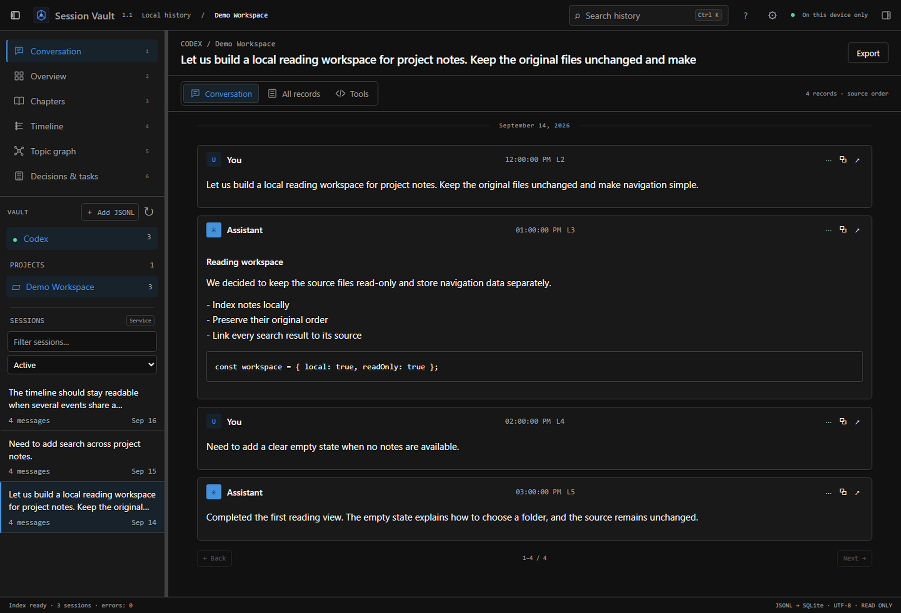
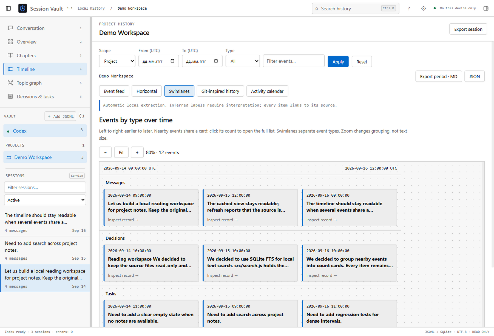

# Session Vault

A local desktop reader for Codex conversation history. Browse conversations, follow recorded branches, search across sessions, and explore project activity without changing the original JSONL files.

Built with Electron and SQLite. Windows x64 is the tested target. **English, Russian and Ukrainian** UI; light, dark and system appearance.

## Screenshots

These screenshots contain **fictional demo conversations only**. No personal Codex sessions are included in this repository.

### Conversation reader



### Project timeline



## What it does

- Open the default Codex sessions folder, another folder, or selected JSONL files.
- Read conversations, code, tool calls and results with source-line navigation.
- Search locally using SQLite FTS, including Cyrillic text.
- View project overviews, daily chapters, recorded parent/fork relationships and an activity calendar.
- Explore horizontal timelines and event lanes. Dense periods become clickable groups instead of overlapping cards.
- Inspect entity references and locally inferred decision/task candidates; optionally correct them with manual annotations.
- Pin/archive entries inside the app and export sessions or filtered periods as Markdown/JSON; copy original JSONL.
- Adjust themes, optional event colors, panel widths and visibility. Workspace preferences persist.

## Run from source

Install Node.js 24+ and npm, then:

```sh
git clone https://github.com/vaulthunt3r/session-vault.git
cd session-vault
npm ci
npm start
```

Select your sources in the welcome screen. Default discovery uses your home folder's `.codex/sessions` directory. The application does not scan until you select a source on first launch.

```sh
npm test
npm run package
```

Packaging must run on Windows x64. It creates a sibling `SessionVault-<version>-Windows` folder and refuses to overwrite an existing build. Keep the complete portable folder together. This repository distributes source; no prebuilt EXE is included.

## Privacy and data

The app runs locally without an account, model API or cloud service. Source JSONL files are read-only. The index, settings and optional annotations are stored separately under `%APPDATA%\session-vault`; `SESSION_VAULT_DATA` can select a separate profile for development.

Exports can contain private conversation content: choose what you share. Real JSONL files, SQLite databases, local profiles, dependencies and build archives are excluded from Git. Tests create synthetic fixtures at runtime. The optional `scripts/validate-local.cjs` reads local sessions only when explicitly run and prints a local report; do not publish that report.

## Honest limits

Automatic event labels use text rules, not AI: they can be wrong. Chapters group UTC days, not semantic project phases. Branches represent recorded parent relationships, not verified Git merges. File nodes represent mentions, not confirmed file changes.

Parsing and analysis are bounded for large logs; the UI discloses limits and filters help narrow the scope. Markdown/media support is partial. New export destinations require a hard-link-capable filesystem (NTFS recommended). Future Codex schema changes may need parser updates. The portable build is unsigned; other operating systems are not certified.

## Documentation and checks

- [Русское руководство](docs/GUIDE.ru.md)
- [Architecture](ARCHITECTURE.md)
- [Validation and reproduction](VALIDATION.md)
- [Current project status](PROJECT_STATUS.md)
- [Historical design audit](DESIGN_AUDIT.md)

Current unit/regression suite: **23 tests**. Electron scenarios additionally cover navigation, sources, exports, annotations, dense timelines, themes and restoration. UI harnesses must use a separate test profile; see VALIDATION.md.

To recreate the two screenshots on Windows, use a fresh temporary profile:

```powershell
$env:SESSION_VAULT_DATA = Join-Path $env:TEMP ('session-vault-demo-' + [guid]::NewGuid())
$env:SESSION_VAULT_SMOKE = Join-Path (Get-Location) 'scripts/screenshots.cjs'
npm run smoke
```

The screenshot harness creates fictional notes and writes images to `docs/screenshots`. It does not select your real Codex sessions.

Session Vault is an independent project and is not affiliated with OpenAI.
